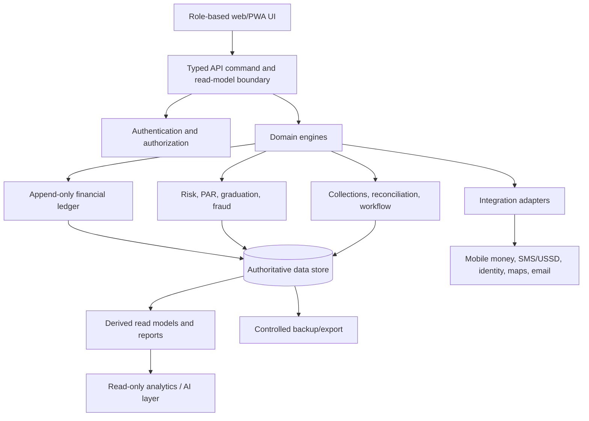

# Progressive Credit & Microfinance Operating System

## Planning status

This document is the controlling plan for the new `Letsgrow-Microcredit` repository. It combines the original product concept, the shared transcript, the first diagram set, and the additional diagram set. The investment-club repository is not part of this codebase. Only general engineering lessons may be reused later after review.

No feature code should be written until Phase 0 artifacts are approved and the decisions below are stable enough for implementation.

## 1. Product goal

Build a secure, auditable operating system for a Uganda-based short-cycle lender serving verified informal businesses. The initial operating model supports small working-capital loans, daily or near-daily repayment, field collection, progressive credit limits, and capital recycling. The first pilot should support approximately 30–50 clients, one branch, and a small officer team, while preserving a path to thousands of clients without changing the fundamental contracts.

The system must answer five questions at all times: who owes money, how much is owed, how likely repayment is, how much can safely be lent, and whether the business is making money and becoming less dependent on external capital.

## 2. Architectural principle

The product is organized as a modular monolith first, with strong boundaries between interface, API commands, business engines, data access, integrations, and infrastructure. This is safer and easier to test than prematurely deploying many independent microservices. Services may later be extracted behind stable contracts when scale or team structure justifies it.

The frontend never becomes the source of truth for balances, allocations, credit limits, or risk decisions. It renders server-returned read models and invokes validated commands.

## 3. UX and interface plan

The primary experience is an internal operations platform with a persistent desktop sidebar for management roles and a focused mobile-first task flow for officers and collectors. The client experience is intentionally narrower and must not expose internal risk, capital, or profitability information.

| Workspace | Primary user | Primary question | Initial screens |
|---|---|---|---|
| Executive dashboard | Super admin, manager | Is the business healthy today? | Portfolio, collections, PAR, liquidity, reserves, net result, alerts |
| Branch workspace | Branch manager | What is happening in my branch? | Branch portfolio, officer performance, approvals, variances, overdue clients |
| Origination workspace | Loan officer, risk officer | Can this client safely receive this loan? | Prospects, KYC, business verification, applications, assessment, approval queue |
| Collection workspace | Collection officer | Who do I collect from today? | Route/list, expected amount, amount collected, overdue, receipt, sync status |
| Finance workspace | Accountant | Do cash, records, and ledger agree? | Disbursements, collections, expenses, reconciliation, pools, reports |
| Risk workspace | Risk officer, manager | Where is exposure becoming dangerous? | PAR ageing, risk grades, concentration, fraud flags, graduation recommendations |
| Client workspace | Client | What do I owe and what have I paid? | Loan status, next payment, receipts, statements, notifications |

Design principles are professional, readable, Uganda-focused, low-bandwidth friendly, and role-specific. The collection interface should minimize navigation, support large tap targets, display sync status, and make the next action obvious. Management interfaces may use dense tables and drill-down analytics; field interfaces should not be overloaded with management metrics.

## 4. Frontend structure and hooks

Use a route-based React/TypeScript application with shared design tokens, typed domain models, form validation, explicit loading/empty/error states, and a transport adapter. The transport adapter initially supports contract-compliant mocks and later the real backend without changing page logic.

Suggested routes include `/login`, `/dashboard`, `/clients`, `/clients/:id`, `/kyc`, `/applications`, `/applications/:id`, `/loans`, `/loans/:id`, `/collections`, `/reconciliation`, `/risk`, `/portfolio`, `/capital`, `/liquidity`, `/accounting`, `/expenses`, `/reports`, `/branches`, `/officers`, `/marketing`, `/settings`, `/audit`, and `/notifications`.

Suggested hooks are `useAuth`, `useCurrentUser`, `usePermissions`, `useDashboardSummary`, `useClient`, `useLoan`, `useLoanApplication`, `useCollectionRoute`, `useOfflineQueue`, `useReconciliationBatch`, `usePortfolioRisk`, `useCapitalPosition`, `useLiquidityPosition`, `useNotifications`, `useAuditEvents`, and `useCommandMutation`. Hooks must consume typed read models and commands; they must not duplicate financial calculations.

The field workflow must support an offline queue with a local event ID, device ID where available, timestamp, actor, client, loan, amount, payment method, receipt, and local status. Synchronization proceeds through validation, duplicate detection, server posting, ledger update, and confirmation. Unresolved conflicts are visible to the officer and manager rather than silently discarded.

## 5. Backend and API plan

The backend is a modular application layer with command handlers and read-model queries. Required domain modules are identity and roles, clients/KYC, businesses and locations, loan products, applications, loan servicing, repayments and collections, receipts, reconciliation, risk and credit graduation, recovery and write-offs, capital pools, accounting, reports, notifications, configuration, audit, and integrations.

Commands are explicit business actions, not unrestricted document updates. Examples include `createClient`, `submitKyc`, `createLoanApplication`, `approveLoan`, `disburseLoan`, `recordCollection`, `submitOfflineCollection`, `reverseCollection`, `recordExpense`, `submitReconciliation`, `writeOffLoan`, `recordRecovery`, `reassessCredit`, and `changePolicy`.

Every command validates authentication, permission, branch scope, entity state, policy version, idempotency key, and required evidence. Every financial command returns a correlation ID and a server-generated result. The API contract is defined in `docs/phase-0/api-contract-outline.md`.

## 6. Database and storage plan

The authoritative financial model must be event-oriented and append-only. Logical entities include users, roles, permissions, branches, clients, businesses, locations, KYC records, documents, references, guarantors, loan products, applications, loans, repayment schedules, payments, receipts, collections, ledger entries, expenses, reserves, growth capital, capital contributions, write-offs, recoveries, risk assessments, portfolio snapshots, notifications, audit events, configuration versions, reconciliation batches, and reports.

Firestore is acceptable for a pilot if financial commands are server-authoritative, transactions are used correctly, and the model avoids pretending that a denormalized document is the complete accounting truth. A later relational ledger can be introduced behind the same API contract. There must be one authoritative source for each financial fact.

Documents belong in controlled object storage with metadata, access scope, retention classification, and audit events. Do not store identity documents in GitHub, frontend bundles, logs, or unrestricted database fields.

## 7. Authentication and permissions

Use authenticated identities with least-privilege role assignments. Roles include super admin, manager, branch manager, loan officer, collection officer, accountant, auditor, analyst, marketing officer, and client. Scope must be enforced by role and branch/assignment, not merely hidden in the UI.

Privileged actions such as approval, disbursement, reversal, write-off, role changes, policy changes, and capital withdrawals should support dual control. Sensitive read access should be logged. Client endpoints expose only the client’s own approved information.

## 8. Financial and risk engines

The ledger and capital-allocation engine are the first business engines to finalize. Contractual charge, collected charge, realized income, costs, reserves, retained profit, and deployable growth capital are separate values. The four pools are principal capital, credit-loss reserve, operating reserve, and growth/reinvestment capital.

Loan products, score weights, risk thresholds, PAR definitions, allocation percentages, approval limits, tier rules, late-payment rules, and notification thresholds are versioned configuration. A completed cycle creates a graduation recommendation, not an automatic loan increase.

Sustainability status requires CIR plus liquidity, reserve sufficiency, operating sustainability, credit sustainability, and planned disbursement capacity. It must also show survival capacity if external capital stops today and expansion capacity under the configured risk assumptions.

## 9. Fourteen-layer delivery architecture

| Layer | Plan for this product |
|---|---|
| 1. Frontend | Role-based React/TypeScript web/PWA with desktop management and mobile field workflows |
| 2. API/backend logic | Typed commands, read models, domain engines, idempotency, state machines |
| 3. Database/storage | Firestore or equivalent operational store, append-only ledger, object storage for documents |
| 4. Authentication/permissions | Authenticated sessions, RBAC, branch scope, least privilege, dual control |
| 5. Hosting/deployment | Firebase Hosting for the web build, controlled environment promotion |
| 6. Cloud infrastructure | Firebase services initially; server functions/services and managed integrations |
| 7. Git/version control | New private GitHub repository, protected main, domain branches, review history |
| 8. CI/CD | Build, types, lint, rules, schema, financial invariants, integration tests, preview and production gates |
| 9. Application security | Threat model, validation, secure documents, no client ledger writes, audit, dependency review, secrets management |
| 10. Rate limiting | Per-user, per-command, per-IP/device where appropriate; stricter limits on authentication and financial commands |
| 11. Caching/CDN | Firebase Hosting CDN for static assets; short-lived safe read-model caching; never cache mutable authorization or financial command results incorrectly |
| 12. Scaling/load balancing | Managed serverless scaling first; load tests, hot-document avoidance, pagination, indexes, later relational/reporting extraction if needed |
| 13. Error tracking/logging | Structured logs, correlation IDs, safe error envelopes, alerting, audit events, provider failure records |
| 14. Availability/disaster recovery | Separate environments, backups/exports, restoration drills, replayable ledger events, outage/manual collection procedures |

The layers should not be implemented in the order listed as if they were independent silos. Security, data integrity, authentication, and observability must be designed into each layer from the beginning.

## 10. Keys and integrations

The system should be designed around adapters, with credentials supplied only when the relevant integration is enabled. Required or likely credentials include Firebase project configuration, server-side Firebase credentials or workload identity, GitHub Actions deployment credentials, SMS/USSD provider credentials, mobile-money provider credentials, identity-verification credentials, email credentials, maps/geolocation credentials, Google Sheets credentials for backup, and optional AI provider credentials.

| Integration | Needed for pilot? | Secret location | Failure behavior |
|---|---:|---|---|
| Firebase Auth | Yes | Environment/managed provider | Block protected access; preserve session errors safely |
| Firestore | Yes | Server-managed credentials | Fail closed for writes; show retry state |
| Cloud Storage | Yes for KYC documents | Server rules and environment | Keep metadata pending; do not lose document status |
| SMS | Useful, not mandatory on day one | Server secret | Queue and retry; show delivery status |
| Mobile money | Depends on disbursement/collection method | Server secret | Store pending provider state; reconcile manually |
| Identity verification | Later pilot enhancement | Server secret | Manual KYC review fallback |
| Maps/geolocation | Useful for field operations | Restricted API key | Permit manual location entry with audit |
| Google Sheets export | Secondary backup | Server credential | Alert and retry; database remains authoritative |
| AI analytics | Later | Server secret | Disable AI only; core operations continue |

No secret belongs in the frontend bundle, GitHub, client storage, screenshots, or audit payloads.

## 11. Testing strategy

Testing is part of the architecture. Pure functions cover schedules, allocation, scoring, PAR, net credit loss, CIR, liquidity, reconciliation, and graduation. Integration tests cover KYC through disbursement and disbursement through collection, allocation, ledger posting, and reporting. Rules tests cover each role and branch scope. End-to-end tests cover the highest-value staff journeys.

The test suite must include partial payments, late payments, defaults, recoveries, write-offs, reversals, duplicate offline submissions, provider retries, cash variance, policy changes, concurrent collection attempts, insufficient liquidity, reserve breaches, and zero/5/8/10/15/20/30% loss scenarios. Tests must prove that a correction never deletes historical financial truth.

## 12. Implementation stages

Stage 0 is planning only: approve the product requirements, schema, permissions, state machines, ledger, allocation policies, API contract, design system, environment matrix, threat model, and test plan.

Stage 1 establishes the frontend shell, authentication screens, role-aware navigation, design tokens, route skeletons, typed mock transport, error/loading states, and the primary dashboard/client/loan/collection visual language. It does not invent backend semantics.

Stage 2 establishes the backend contract, authentication, roles, database schema, rules, migrations, command handlers, ledger primitives, audit, and financial invariant tests.

Stage 3 connects the frontend to development APIs and delivers clients, KYC, loan products, applications, approvals, disbursement, schedules, payments, receipts, collections, and reconciliation.

Stage 4 adds offline field operation, risk/PAR, credit graduation, fraud flags, recovery, write-offs, capital pools, expenses, liquidity, CIR, and sustainability.

Stage 5 adds management dashboards, reports, Sheets backup, notifications, integrations, production hardening, restoration drills, and controlled release.

Stage 6 adds read-only AI/MCP analytics and simulation only after the core operating loop and ledger are trusted.

## 13. Agent collaboration model

The frontend agent and backend agent should not work from separate interpretations. The shared GitHub repository contains the contract and test fixtures. The frontend agent owns UI, hooks, route composition, accessibility, and mock transport. The backend agent owns commands, schema, rules, ledger, integrations, and server tests. Cross-boundary changes update contracts and tests together.

The first coding milestone should be a reviewable Phase 0 package, not a dashboard. Once Phase 0 is approved, frontend work and backend work can proceed in parallel against the contract, followed by a deliberate integration stage.

## 14. Decision gate before code

Before implementation begins, approve: the new repository name and ownership, Firebase project/environment names, whether Firestore is sufficient for the pilot ledger, the first three loan products, the payment waterfall, allocation policy version 1, PAR and net-credit-loss definitions, role/branch permissions, offline conflict policy, notification providers, data retention policy, and the exact pilot acceptance test.

This document and the Phase 0 artifacts are the plan. Any agent prompt that conflicts with them must be corrected before code is accepted.

## References

[1]: https://firebase.google.com/docs/firestore/manage-data/transactions "Firebase: Transactions and batched writes"

[2]: https://firebase.google.com/docs/firestore/security/get-started "Firebase: Get started with Cloud Firestore Security Rules"

[3]: https://firebase.google.com/docs/hosting/github-integration "Firebase: Deploy to live and preview channels via GitHub pull requests"

[4]: https://firebase.google.com/docs/hosting/usage-quotas-pricing "Firebase: Hosting usage, quotas, and pricing"

[5]: https://firebase.google.com/pricing "Firebase Pricing"

[6]: https://docs.replit.com/build/import-from-providers "Replit: Import from a provider"
